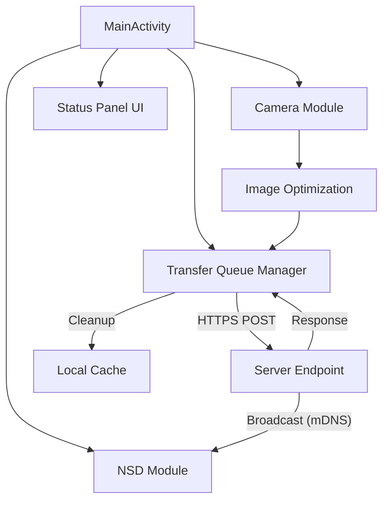

# System Architecture & Design

## 1. System Overview

## 2. Architecture Principles
- **고응집 & 저결합**: 각 모듈(Camera, Network, Queue)은 독립된 책임을 가지며 인터페이스와 데이터 스트림(StateFlow)으로만 소통함.
- **의도 명확화**: 모든 설계 단계에서 사용자 의도 확인 및 명확화 절차 준수.

## 3. Network Sequence
1. **Server**: "CamSenderServer" 서비스 브로드캐스트.
2. **Android (NSD)**: 서비스 탐색 및 IP/Port 동적 획득.
3. **Android (Camera)**: 4:3 비율로 이미지 캡처.
4. **Android (Optimization)**: 1920x1440 해상도 리사이징 및 JPEG Quality 80 압축 후 `cacheDir` 저장.
5. **Android (Queue)**: `TransferManager`에 작업 등록 및 백그라운드 전송 시작.
5. **Android (Network)**: HTTPS Multipart POST 전송.
6. **Result Handling**: 전송 성공 시 파일 삭제, 실패 시 보관 및 사용자 알림.

## 4. Package Structure
- `com.example.camsender`
    - `.ui`: Activity, BottomSheet, Adapter
    - `.camera`: `CameraHelper` (CameraX 제어)
    - `.network`: `NsdHelper`, `TransferManager`, `SslConfigHelper`
    - `.model`: `TransferJob`
    - `.utils`: File/Storage 유틸리티
