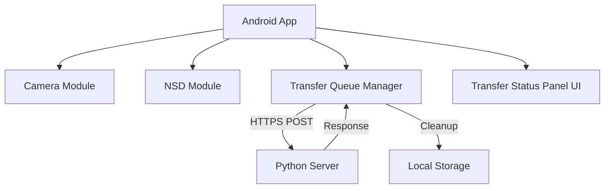

# System Architecture & Design

## 1. System Overview

## 2. Network Sequence (Discovery to Upload)
1. **Server:** `Zeroconf`를 통해 `_http._tcp` 서비스 브로드캐스트.
2. **Android:** `NsdManager`로 서비스 탐색 및 IP/Port 획득.
3. **Android:** 유저가 촬영 버튼 클릭 -> CameraX 이미지 캡처.
4. **Android:** `cacheDir`에 임시 파일 생성.
5. **Android:** OkHttp 클라이언트를 통해 서버로 파일 전송 (HTTPS).
6. **Server:** 파일 수신 및 처리 시작.
7. **Android:** 서버 응답(HTTP 200 등) 수신 시 즉시 로컬 파일 삭제.

## 3. Android Package Structure (Planned)
- `com.example.camsender`
    - `.ui`: Activity, ViewBinding, **BottomSheet/Panel** 관련 클래스
    - `.camera`: `CameraHelper` (CameraX 설정 및 캡처 로직)
    - `.network`: `NsdHelper`, **`NetworkClient` (SSL/Cert 관리)**, **`TransferManager` (큐 관리)**
    - `.model`: **`TransferJob` (전송 상태 데이터 클래스)**
    - `.utils`: 파일 관리 유틸리티
